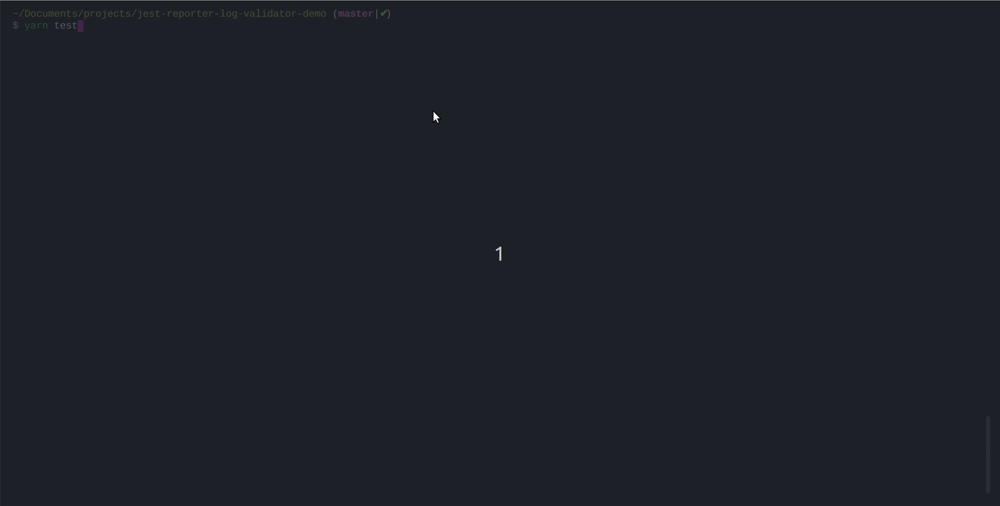

<h1 align="center">
  <br>jest-reporter-log-validator ⚠️ 
  <br>
</h1>

<h4>Make your tests fail when unwanted log/warning/error messages are found.</h4>



## What this project aims to solve
Warning messages generated by tests can quickly accumulate, which can cause bugs for our users and a lousy development experience. This project enables creating validations for console messages based on string patterns to prevent more warnings from being added.

> Log message will refer in this documentation to any message generated while running the tests by calling the `console` object's methods. For example, console.warn or console.error.

## Requirements
For this plugin to work, you must run jest with the config flag verbose as `false`. Unfortunately, verbose mode doesn't provide the console messages to custom jest reporters.

## Setup

### Installation
```
npm install -D jest-reporter-log-validator
```
or
```
yarn add -D jest-reporter-log-validator
```

### Adding the reporter

This reporter is intended to be used when running all your tests. To do so, you need to add it to your configuration.

If you are using a jest.config.json
```
{
  ...,
  "reporters": [
    "default",
    "jest-reporter-log-validator"
  ],
  ...
}
```

If you're using create-react-app (which doesn't yet support `jest.config.json`), you can still use this reporter through the CLI like this:

```
{
    ...
    "test:all": "react-scripts test --reporters=default --reporters=jest-reporter-log-validator --verbose=false --watchAll=false"
}
```

## Configuration

| Option name | Type | Description | Default value |
|----|----|----|----|
|`logValidations`|`Array<{"patterns": Array<string>,"max": number}>`|Allows you to add a maximum to the number of times a certain log message can appear in your tests. For one element on this array to match a log message, all strings in the `patterns` attribute must match.|[]|
|`failIfLogRestrictionsOutdated`|`boolean`|If the reporter finds that the max you defined in `logValidations` for some message can be lower, setting this flag to true will make the reporter throw an error. **This is enabled by default so you can progressively lower the number of messages generated in your tests.**|true|
|`failIfUnknownLogsFound`|`boolean`|If a log message which isn't defined in `logValidations` or `exemptLogs` is found, the reporter will throw an error. **Use this when you have limited all possible logs in your tests and want to avoid new ones from being generated**|false|
|`exemptLogs`|`Array<{"patterns": Array<string>}>`}>|Defines a list of messages which don't have a maximum number of times they can appear and won't generate an error if `failIfUnknownLogsFound` is set to true. **Use this if there are warnings that you cannot avoid at the moment or are flaky, and you can't know the exact number for sure.**|[]|

**Complete example**
```
{
  "logValidations": [
    {
      "patterns": ["Warning: You cannot change <Router history>"],
      "max": 4
    },
    {
      "patterns": ["Warning: An update to", "inside a test was not wrapped in act(...)."],
      "max": 20
    }
    // Other log validations here
  ],
  "exemptLogs": [
    {
      "patterns": ["Warning: A component is changing an uncontrolled input of type text to be controlled"]
    },
  ],
  "failIfUnknownLogsFound": false,
  "failIfLogRestrictionsOutdated": true
}
```

**Precedence**
You have several options to add your log validation configuration. The order of precedence, from highest to lowest priority, is as follows:

1. Configuration file `.jest-logs-validations-config.json`
2. Reporter parameters from `jest.config.json`
3. `jest-reporter-log-validator` key inside the `package.json`
4. Default values (as detailed in the configuration table)

### Configuration file
In the root of your project, create a file called `.jest-reporter-log-validator-config.json`. It will contain the validations to apply for the log messages.

### Adding parameters to your jest.config.json
In the `reporters` section of your jest.config.json, add the following
```
{
  "reporters": [
    "default",
    ["jest-reporter-log-validator", {
      "logValidations": [{
        "patterns": ["Warning: You cannot change <Router history>"],
        "max": 4
      }],
    }
  ],
}
```

### Adding a key in your package.json
In your `package.json` file, you can add a key with the name `jest-reporter-log-validator` like this:

```
{
  "name": "foo"
  "version": "1.0.0",
  "jest-reporter-log-validator": {
    "logValidations": [
      {
        "patterns": ["warning defined in package.json"],
        "max": 1
      }
    ],
  }
}
```

## Recipes
These are some common scenarios where you'll want to use this reporter

### If you have an existing project with a lot of warnings and want to stop them from growing
The first recommendation here is to add all known warnings to the `logValidations` config if the number of times it appears is constant. For log messages that appear a non-fixed number of times, use `exemptLogs`. Here's the final configuration:
```
{
  "logValidations": [
    {
      "patterns": ["Warning: You cannot change <Router history>"],
      "max": 4
    },
    {
      "patterns": ["Warning: An update to", "inside a test was not wrapped in act(...)."],
      "max": 20
    }
    // Other log messages here
  ],
  "exemptLogs": [
    {
      "patterns": ["Warning: A component is changing an uncontrolled input of type text to be controlled"]
    },
    {
      "patterns": ["Deprecation warning: value provided is not in a recognized RFC2822 or ISO format"]
    }
  ],
  "failIfUnknownLogsFound": true,
  "failIfLogRestrictionsOutdated": true
}
```

### If you're starting a new project and want to be as strict as possible from the get-go with log messages
The recommendation here is to be as strict as possible.
```
{
  "failIfUnknownLogsFound": true,
  "failIfLogRestrictionsOutdated": true
}
```

### If you have a handful of widespread warnings and want to prevent them from growing
Add the messages in question to the `logValidations` config and set the rest of the flags as follows:
```
{
  "logValidations": [
    {
      "patterns": ["Warning: You cannot change <Router history>"],
      "max": 4
    },
    {
      "patterns": ["Warning: An update to", "inside a test was not wrapped in act(...)."],
      "max": 20
    }
    // Other log messages here
  ],
  "failIfLogRestrictionsOutdated": true
}
```
